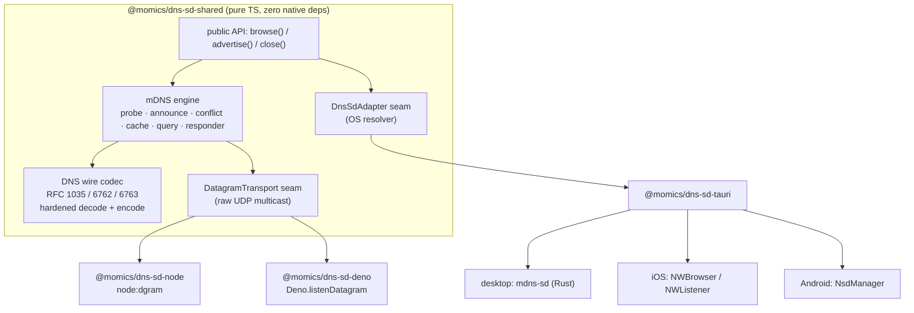

# @momics/dns-sd

> [!WARNING]
> **Experimental — use at your own risk.** This entire repository and all of its
> packages are experimental, largely untested, and mostly AI-generated. They are
> not production-ready and should not be relied upon for anything important.

A standards-compliant **DNS-SD** (DNS Service Discovery over
multicast DNS) library family for TypeScript. One simple, identical public API —
`browse` and `advertise` — across every runtime: **Deno**, **Node.js** and
**Tauri** (desktop **and** mobile).

> **Status:** pre-release / not yet published. Package names and version
> numbers in this repo are placeholders; there are no npm/JSR badges because
> nothing has been published yet.

## What it is

`@momics/dns-sd` lets you discover and advertise services on the local network
using multicast DNS / DNS-SD — the same technology behind Bonjour and Zeroconf.
The heavy lifting (the wire protocol and the mDNS state machine) lives in one
runtime-agnostic package with **zero native dependencies**; each runtime plugs a
thin backend into a well-defined seam and re-exports the identical public API.

## Packages

| Package | Runtime | Backend | README |
| --- | --- | --- | --- |
| [`@momics/dns-sd-shared`](./packages/dns-sd-shared) | any | pure-TS RFC 1035/6762/6763 codec + mDNS engine + seams | [README](./packages/dns-sd-shared/README.md) |
| [`@momics/dns-sd-node`](./packages/dns-sd-node) | Node.js | `node:dgram` UDP multicast `DatagramTransport` | [README](./packages/dns-sd-node/README.md) |
| [`@momics/dns-sd-deno`](./packages/dns-sd-deno) | Deno | `Deno.listenDatagram` UDP multicast `DatagramTransport` | [README](./packages/dns-sd-deno/README.md) |
| [`@momics/dns-sd-tauri`](./packages/dns-sd-tauri) | Tauri v2 | `DnsSdAdapter` over the OS resolver (Rust `mdns-sd`, Swift `NWBrowser`, Kotlin `NsdManager`) | [README](./packages/dns-sd-tauri/README.md) |

Deno and Node.js speak mDNS directly over a `DatagramTransport` (the shared
engine drives the protocol). Tauri — which must go through the operating
system's resolver on mobile — plugs in a higher-level `DnsSdAdapter` instead.
Either way, callers get the exact same `browse` / `advertise` API.

## Runtimes

| Runtime     | Discovery mechanism                                       | Uses shared mDNS engine? |
| ----------- | --------------------------------------------------------- | ------------------------ |
| **Node.js** | Native UDP multicast (`node:dgram`)                       | ✅ yes                   |
| **Deno**    | Native UDP multicast (`Deno.listenDatagram`)              | ✅ yes                   |
| **Tauri**   | OS resolver — `mdns-sd` (desktop), `NWBrowser` (iOS), `NsdManager` (Android) | ❌ OS owns the protocol |

## Platform support matrix

| Platform | Runtime(s)          | Support | Notes |
| -------- | ------------------- | ------- | ----- |
| Linux    | Node.js, Deno, Tauri (desktop) | ✅ full | raw UDP multicast |
| macOS    | Node.js, Deno, Tauri (desktop) | ✅ full | raw UDP multicast (see [interop notes](#real-network--cross-runtime-verification)) |
| Windows  | Node.js, Deno, Tauri (desktop) | ✅ full | raw UDP multicast |
| iOS      | Tauri               | ✅ full | via `NWBrowser`/`NWListener` + `NetService` resolution |
| Android  | Tauri               | ✅ full | via `NsdManager` (all addresses + live updates on Android 14+); see notes below |

**Mobile limitations** (honest — these follow directly from the OS APIs, see the
[Tauri package README](./packages/dns-sd-tauri/README.md#platform-matrix--limitations)):

- **iOS (`NWBrowser` + `NetService`)** discovers endpoints and their TXT records
  with `NWBrowser`, then resolves each instance's host name, port and IP
  addresses through `NetService` (Bonjour). Browse events are emitted as `found`
  first, then `resolved` once host/port/addresses are available — matching every
  other platform.
- **Android (`NsdManager`)** resolves each discovered instance to its port and
  **all** of its IP addresses. On Android 14+ (API 34) it uses
  `registerServiceInfoCallback`, which returns every address and streams live
  address/TXT changes as `updated` events; on older versions the legacy resolver
  returns a single address. A custom advertise `host` is honoured when it is a
  numeric IP literal on Android 14+ (via `setHostAddresses`); a custom host
  *name*, and the non-`local` domain, are still chosen/limited by the OS.
  `NsdManager` also cannot represent a bare TXT key distinctly from an empty
  value (both surface as `true`), and subtypes on `advertise` require Android 15+
  (API 35), so at the current compile SDK they are accepted for API parity but
  not registered.

## Quick start

Install the package for your runtime and import the identical `browse` /
`advertise` API. Below is the same task in each runtime.

### Node.js

```bash
npm install @momics/dns-sd-node
```

```typescript
import { advertise, browse, close } from "@momics/dns-sd-node";

const handle = await advertise({
  service: { type: "http", protocol: "tcp", name: "My Web Server", port: 8080 },
});

for await (const svc of browse({ service: { type: "http", protocol: "tcp" }, timeoutMs: 5000 })) {
  if (svc.kind === "resolved") console.log(`Found ${svc.name} at ${svc.host}:${svc.port}`, svc.txt);
}

await handle.stop(); // send a goodbye and unregister
await close();
```

### Deno

```typescript
// deno add jsr:@momics/dns-sd-deno   (placeholder — not yet published)
import { advertise, browse, close } from "@momics/dns-sd-deno";

const handle = await advertise({
  service: { type: "http", protocol: "tcp", name: "My Web Server", port: 8080 },
});

for await (const svc of browse({ service: { type: "http", protocol: "tcp" }, timeoutMs: 5000 })) {
  if (svc.kind === "resolved") console.log(`Found ${svc.name} at ${svc.host}:${svc.port}`, svc.txt);
}

await handle.stop();
await close();
```

Run with the required permissions/flags:
`deno run --unstable-net --allow-net --allow-sys your-script.ts`.

### Tauri

```bash
npm install @momics/dns-sd-tauri   # guest-js bindings
```

Register the plugin in your Rust app (`tauri-plugin-dns-sd`) and call the same
API from your frontend:

```typescript
import { advertise, browse, close } from "@momics/dns-sd-tauri";

const handle = await advertise({
  service: { type: "http", protocol: "tcp", name: "My Web Server", port: 8080 },
});

for await (const svc of browse({ service: { type: "http", protocol: "tcp" } })) {
  // On iOS, expect kind "found" with null host/port (see mobile limitations).
  console.log(svc.kind, svc.name, svc.host, svc.port, svc.txt);
}

await handle.stop();
await close();
```

See the [Tauri package README](./packages/dns-sd-tauri/README.md) for plugin
registration, permissions, and the example app.

## Architecture

The shared package implements the mDNS protocol **once** behind two backend
seams. Runtimes with raw UDP sockets implement `DatagramTransport`; platforms
that must defer to the OS resolver implement `DnsSdAdapter`.



- The **shared engine** implements probing → announcing → conflict resolution,
  the cache with cache-flush / TTL / goodbye handling, known-answer suppression,
  and the DNS-SD query/responder logic — all over an abstract transport.
- The **`DatagramTransport`** seam is a tiny interface (`send` / `receive` /
  `localAddresses` / `close`); Node and Deno each implement it over their native
  UDP multicast socket, including self-echo suppression.
- The **`DnsSdAdapter`** seam exists for platforms that cannot do raw multicast
  (notably iOS/Android): the OS performs mDNS and the adapter maps its events to
  our `ServiceAnnouncement` type.
- An **in-memory loopback transport** implements a virtual multicast bus so the
  entire engine is deterministically testable with no network, and a shared
  **conformance suite** (`@momics/dns-sd-shared/testing`) lets every runtime
  prove identical behaviour.

## Standards compliance

The shared engine and codec implement:

- **RFC 1035** — base DNS message format, including message name-compression
  pointers on both encode and decode.
- **RFC 6762** — Multicast DNS: the probing (3× 250 ms) → announcing (≥2
  announcements) → conflict-resolution/rename lifecycle, the cache-flush bit,
  TTL=0 "goodbye" records, known-answer suppression, correct TTLs (120 s for
  A/AAAA/SRV/host, 4500 s for PTR), and the QU/QM unicast-response bit.
- **RFC 6763** — DNS-Based Service Discovery: PTR/SRV/TXT/A/AAAA records, the
  three-state TXT model (bare key → `true`, `key=value`, `key=` → empty),
  service-instance enumeration, subtypes, and the
  `_services._dns-sd._udp.local` meta-query.

The decoder is hardened with strict bounds checking so malformed or hostile
packets can never read out of range or hang the process. A per-runtime
[compliance report](#standards-compliance) accompanies the integration PR.

## Real-network & cross-runtime verification

Unit and conformance tests run entirely in-memory (no network) and pass under
both Deno and Node. In addition, **real-network** conformance suites and a
**cross-runtime interop** suite (advertise in one runtime ↔ browse in another
over real loopback multicast) exercise genuine UDP multicast. These are **gated
behind `DNS_SD_NETWORK_TESTS=1`** because many CI runners and some corporate
networks block multicast:

```bash
# Node real-network conformance
DNS_SD_NETWORK_TESTS=1 npm run test:node --workspace @momics/dns-sd-node
# Deno real-network conformance
DNS_SD_NETWORK_TESTS=1 deno task test:deno-runtime
# Tauri desktop (Rust mdns-sd) real-network test
cd packages/dns-sd-tauri && DNS_SD_NETWORK_TESTS=1 cargo test
# Cross-runtime interop (Node <-> Deno, both directions)
npm run build && DNS_SD_NETWORK_TESTS=1 npm run test:interop
```

> **Environment note:** multicast availability is a property of the host, not the
> library. On the macOS (arm64) development host used for integration, Node's
> `node:dgram` and the Rust `mdns-sd` real-network paths pass, but Deno's
> `Deno.listenDatagram` multicast is non-functional (its datagrams do not egress
> and it receives none), so the Deno real-network and Deno interop legs cannot
> complete there. The Node↔Node interop leg passes, proving the harness, wire
> format and independent-process multicast; the Deno legs are expected to pass on
> hosts where Deno multicast works (e.g. Linux). This is a runtime/OS limitation,
> not a defect in this code.

## Development

This is a dual **Deno + npm** workspace, plus a Rust crate for the Tauri plugin.

```bash
# Deno
deno fmt --check                 # formatting
deno lint                        # lint
deno task check                  # typecheck shared (source + tests)
deno task check:deno-runtime     # typecheck the Deno runtime package
deno task test                   # shared suite under Deno
deno task test:deno-runtime      # Deno transport unit tests

# Node / npm
npm ci
npm run typecheck                # tsc across all workspaces
npm run build                    # build all TS packages
npm run test:node                # shared + node runtime suites under Node

# Tauri plugin (Rust, desktop)
cd packages/dns-sd-tauri
cargo clippy --all-targets
cargo test
```

CI typechecks, lints and format-checks the workspace, runs the shared suite
under **both** Deno and Node (to guarantee runtime-neutrality), runs the Node
and Deno runtime unit tests, and builds/tests the Tauri Rust plugin on Linux,
macOS and Windows. The env-gated real-network and interop tests are intentionally
**not** run in CI (they require working multicast). There is no publishing/
release workflow.

## Caveats (honest ones)

- This is **not** a browser library — browsers cannot open raw UDP multicast
  sockets, and there is no WebExtension mDNS API.
- On **mobile** (iOS/Android) discovery goes through the OS resolver via the
  Tauri adapter; you do not get raw packet-level control there, and the platform
  imposes its own permission prompts and limitations (see the matrix above).
- Multicast behaviour depends on the network and host runtime: some Wi-Fi
  networks and VPNs block or rate-limit multicast, and some runtimes have
  platform-specific multicast quirks (see the environment note above).

## Contributing

See [CONTRIBUTING.md](./CONTRIBUTING.md).

## License

Dual-licensed under either of

- Apache License, Version 2.0 ([LICENSE-APACHE](./LICENSE-APACHE))
- MIT license ([LICENSE-MIT](./LICENSE-MIT))

at your option.
